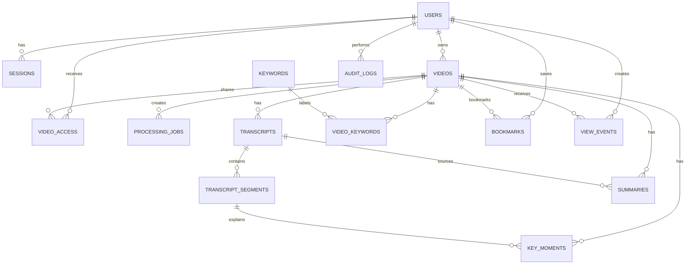

# ClipMind AI — Database Schema

This schema is the Day 2 build contract. PostgreSQL is the only application database for the 25-day MVP. Media files remain in private object storage; the database stores their metadata and object key, never the video bytes.

## Entity relationship diagram

## Tables and columns

### `users`

| Column | Type | Rule |
|---|---|---|
| id | UUID | primary key, generated server-side |
| email | CITEXT | unique, required |
| password_hash | TEXT | Argon2id hash only |
| display_name | VARCHAR(80) | required |
| role | ENUM | `creator`, `learner`, `educator`, `administrator` |
| status | ENUM | `active`, `suspended` |
| created_at, updated_at | TIMESTAMPTZ | server-managed |

### `sessions`

`id UUID PK`, `user_id UUID FK users`, `refresh_token_hash TEXT`, `expires_at TIMESTAMPTZ`, `revoked_at TIMESTAMPTZ NULL`, `created_at TIMESTAMPTZ`. Index: `(user_id, expires_at)`.

### `videos`

`id UUID PK`, `owner_id UUID FK users`, `title VARCHAR(180)`, `description TEXT NULL`, `object_key TEXT UNIQUE`, `original_name VARCHAR(255)`, `mime_type VARCHAR(100)`, `byte_size BIGINT`, `duration_seconds INTEGER NULL`, `status ENUM`, `language_code VARCHAR(12) NULL`, `created_at`, `updated_at`, `deleted_at NULL`.

`status` is one of `uploading`, `queued`, `processing`, `ready`, `failed`, `deleted`. Index `(owner_id, created_at DESC)`.

### `video_access`

`video_id UUID FK videos`, `user_id UUID FK users`, `granted_by UUID FK users`, `permission ENUM('view')`, `expires_at TIMESTAMPTZ NULL`, `created_at`. Composite primary key `(video_id, user_id)`. This is the explicit sharing list; no public video access exists in v1.

### `processing_jobs`

`id UUID PK`, `video_id UUID FK videos`, `kind ENUM('extract_audio','transcribe','summarize','key_moments')`, `status ENUM('queued','running','completed','failed','cancelled')`, `attempt SMALLINT DEFAULT 0`, `progress SMALLINT DEFAULT 0`, `error_code VARCHAR(64) NULL`, `error_message TEXT NULL`, `started_at NULL`, `finished_at NULL`, `created_at`.

Constraint: `progress` is 0–100. Index `(video_id, status, created_at DESC)`.

### `transcripts` and `transcript_segments`

`transcripts`: `id UUID PK`, `video_id UUID FK`, `version INTEGER`, `language VARCHAR(12)`, `source ENUM('whisper','human_edit')`, `body TEXT`, `created_by UUID FK users NULL`, `is_current BOOLEAN`, `created_at`.

Unique `(video_id, version)` and partial unique index for one current transcript per video.

`transcript_segments`: `id UUID PK`, `transcript_id UUID FK`, `sequence INTEGER`, `start_ms INTEGER`, `end_ms INTEGER`, `text TEXT`, `confidence NUMERIC(4,3) NULL`. Unique `(transcript_id, sequence)`; check `end_ms > start_ms`.

### `summaries`, `key_moments`, and keywords

`summaries`: `id UUID PK`, `video_id UUID FK`, `transcript_id UUID FK`, `version INTEGER`, `kind ENUM('short','detailed')`, `content TEXT`, `model_name VARCHAR(160)`, `status ENUM('ready','failed')`, `created_at`. Unique `(video_id, transcript_id, version, kind)`.

`key_moments`: `id UUID PK`, `video_id UUID FK`, `transcript_segment_id UUID FK`, `start_ms INTEGER`, `end_ms INTEGER`, `title VARCHAR(180)`, `rationale TEXT`, `score NUMERIC(5,4)`, `rank SMALLINT`, `created_at`. Unique `(video_id, rank)`.

`keywords`: `id UUID PK`, `text CITEXT UNIQUE`; `video_keywords`: `video_id UUID FK`, `keyword_id UUID FK`, `score NUMERIC(5,4)`, composite primary key `(video_id, keyword_id)`.

### User activity and audit

`bookmarks`: `id UUID PK`, `user_id UUID FK`, `video_id UUID FK`, `moment_id UUID FK key_moments NULL`, `note VARCHAR(500) NULL`, `created_at`; unique `(user_id, video_id, moment_id)`.

`view_events`: `id UUID PK`, `user_id UUID FK`, `video_id UUID FK`, `event_type ENUM('opened','searched','timestamp_clicked','bookmarked')`, `occurred_at`. Index `(video_id, event_type, occurred_at)`.

`audit_logs`: `id UUID PK`, `actor_id UUID FK users NULL`, `action VARCHAR(80)`, `entity_type VARCHAR(40)`, `entity_id UUID NULL`, `ip_hash VARCHAR(128) NULL`, `metadata JSONB`, `occurred_at`. It is append-only.

## Build rules

- Every foreign key uses UUID and timestamps use UTC (`TIMESTAMPTZ`).
- Use Alembic migrations; do not hand-edit production tables.
- Soft-delete a video first, then remove object and derived rows through a controlled background task.
- Apply PostgreSQL RLS policies described in `ClipMindAI_Security_and_Access.md` when tables are created on Day 4–6.
